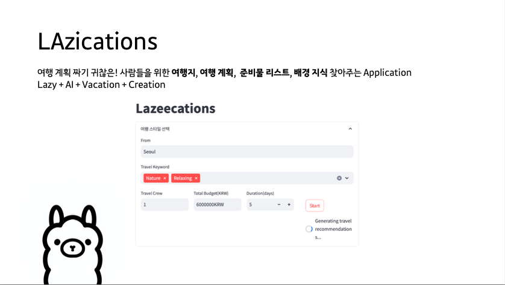
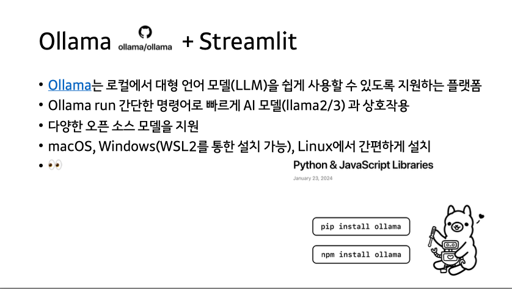

# Lazication
## 소개 




## 실행 방법 
1. conda env 생성 
```
conda create --name myenv python=3.9
```

2. conda env 활성화 
```
conda activate myenv
```

3. 설치
```
pip install -r requirements.txt
```

3. 실행
```
streamlit run script_llama.py

```
